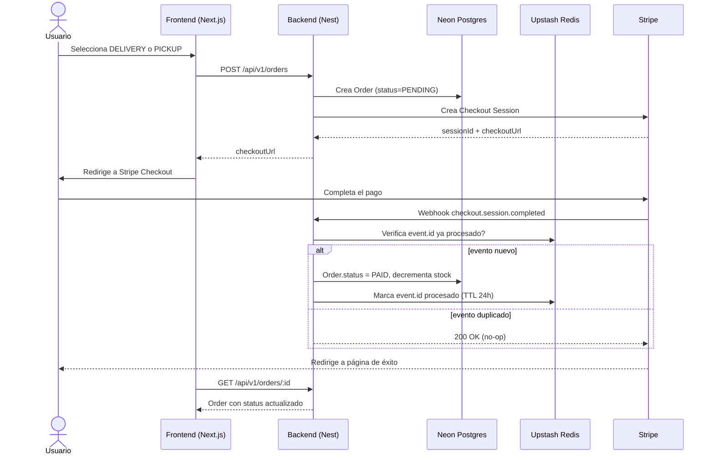

# Arquitectura — TechStore

## Visión general

```
┌──────────────┐        HTTPS/JSON         ┌────────────────────┐
│   Frontend   │ ────────────────────────▶ │      Backend       │
│  Next.js 16  │ ◀──────────────────────── │   NestJS 11 API    │
│  (App Router)│      Bearer JWT           │                    │
└──────┬───────┘                           └─────────┬──────────┘
       │ NextAuth (session)                          │
       │ Credentials / Google                        │
       ▼                                             ▼
┌───────────────┐                           ┌────────────────────┐
│   NextAuth    │                           │   Neon Postgres    │
│  (frontend)   │                           │   (TypeORM)        │
└───────────────┘                           └────────────────────┘
                                                      │
                                            ┌────────────────────┐
                                            │  Upstash Redis     │
                                            │  (REST client)     │
                                            └────────────────────┘
                                                      │
                                            ┌────────────────────┐
                                            │      Stripe        │
                                            │ Checkout+Webhooks  │
                                            └────────────────────┘
```

## Módulos backend (`backend/src/`)

| Módulo | Responsabilidad |
|---|---|
| `auth/` | JWT strategy, `RolesGuard`, `@Roles()` decorator, `login`/`register`, endpoint `oauth/verify` para el puente con NextAuth |
| `users/` | Entidad `User`, roles (`customer` / `admin`) |
| `categories/` | Árbol de categorías (laptops, PCs, componentes, periféricos) |
| `products/` | `Product` + `ProductVariant` (specs: RAM/almacenamiento/color), stock |
| `pickup-locations/` | Sucursales de recojo (nombre, dirección, horario) |
| `cart/` | Carrito de usuario autenticado (Postgres) + guest cart (Redis) |
| `orders/` | `Order` + `OrderItem`, `fulfillmentType` (`DELIVERY` \| `PICKUP`) |
| `coupons/` | Cupones de descuento, validación en checkout |
| `payments/` | Stripe Checkout Sessions + webhook controller |
| `common/` | Guards, decorators, filters, pipes, rate-limit guard |
| `config/` | `@nestjs/config` + validación de env vars al boot |
| `database/` | TypeORM datasource (Neon) + migrations |
| `cache/` | Wrapper sobre `@upstash/redis` para cache-aside |

No existe módulo de reviews (descartado).

## Flujo de autenticación (NextAuth ↔ Nest JWT)

1. **Credentials**: usuario ingresa email/password en Next → NextAuth `authorize()` llama `POST /auth/login` en Nest → Nest valida y devuelve JWT propio (con `sub`, `role`) → NextAuth guarda ese JWT dentro del `token`/`session` (callback `jwt`).
2. **OAuth (Google)**: NextAuth resuelve el flujo Google → callback `signIn` llama `POST /auth/oauth/verify` en Nest con el perfil → Nest hace upsert del `User` y devuelve JWT propio → se guarda igual que el caso anterior.
3. Nest es la única fuente de verdad de roles/permisos. Todas las llamadas del frontend a la API adjuntan `Authorization: Bearer <jwt-de-nest>` (no el JWT interno de NextAuth).
4. `RolesGuard` en Nest protege rutas admin (`admin/*` en frontend + endpoints `@Roles('admin')` en backend).

## Flujo de checkout (delivery / pickup)

1. Usuario arma carrito (autenticado → Postgres, invitado → Redis).
2. En checkout elige `fulfillmentType`:
   - `DELIVERY`: captura dirección, aplica tarifa fija de envío.
   - `PICKUP`: elige `pickupLocationId` de la lista de sucursales, sin costo de envío.
3. Se crea `Order` en estado `PENDING` con snapshot de items/precios.
4. Backend crea Stripe Checkout Session (monto = subtotal + envío si aplica − cupón).
5. Usuario paga en Stripe → webhook `POST /payments/webhook` confirma pago → `Order.status = PAID`.
6. Webhook es idempotente: `event.id` de Stripe se guarda en Redis (TTL 24h); si se reintenta, se ignora.

### Diagrama de secuencia — checkout



## Uso de Redis (Upstash)

| Uso | Detalle |
|---|---|
| Cache de catálogo | Cache-aside en `GET` de `products`/`categories`, TTL corto (~5 min), invalidado en escritura admin |
| Guest cart | Carrito de invitado por cookie `cartId`, TTL ~14 días; se mergea al `Cart` de Postgres al iniciar sesión |
| Rate limiting | `@upstash/ratelimit` como guard en `/auth/login`, `/auth/register`, `/checkout` |
| Idempotencia webhook | `event.id` de Stripe procesados, TTL 24h |

Optimización futura (no MVP): lock distribuido en Redis para decremento de stock y evitar overselling en checkouts concurrentes.

## Frontend (`frontend/app/`)

```
(auth)/login, register
(shop)/products, products/[slug], categories/[slug]
cart/
checkout/                 # elegir DELIVERY o PICKUP
account/orders, account/profile, account/wishlist
admin/products, admin/orders, admin/coupons, admin/pickup-locations
```

- `lib/auth.ts` — configuración NextAuth (Credentials + Google, puente JWT descrito arriba)
- `lib/api.ts` — fetch wrapper que adjunta el JWT de Nest como Bearer en cada request

## Infraestructura

- **Neon Postgres**: base de datos cloud desde el día 1, sin Postgres local. Connection string con `sslmode=require`. Migrations vía TypeORM (no `synchronize` en producción).
- **Upstash Redis**: cliente REST (`@upstash/redis`), sin necesidad de conexión TCP persistente — friendly para entornos serverless.
- **Stripe**: modo test en desarrollo, claves via env vars, webhook firmado y verificado (`STRIPE_WEBHOOK_SECRET`).

Sin Docker Compose: ambas dependencias de datos son servicios cloud administrados.
