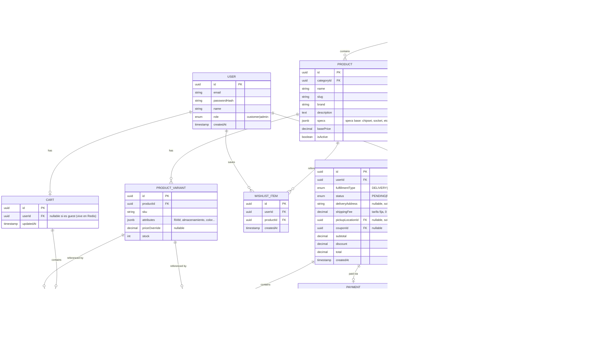

# Data Model — TechStore

Base de datos: Neon Postgres, acceso vía TypeORM. Diagrama en Mermaid (renderiza en GitHub/GitLab nativamente).

## Notas de diseño

- **Snapshots de precio**: `CART_ITEM.unitPriceSnapshot` y `ORDER_ITEM.unitPriceSnapshot` congelan el precio al momento de agregar/ordenar — cambios posteriores en `PRODUCT_VARIANT.priceOverride` no afectan carritos/órdenes existentes.
- **Guest cart**: no existe fila `CART` en Postgres para invitados; vive en Redis (`cart:guest:<cartId>`) y se migra a `CART` + `CART_ITEM` al iniciar sesión.
- **Stock**: vive en `PRODUCT_VARIANT.stock`, decrementado al confirmar pago (`Order.status = PAID`), no al agregar al carrito.
- **fulfillmentType**: `DELIVERY` requiere `deliveryAddress` + `shippingFee` fijo; `PICKUP` requiere `pickupLocationId`, `shippingFee = 0`.
- **Sin módulo reviews**: descartado explícitamente del alcance.
- Índices recomendados: `PRODUCT.slug` (unique), `PRODUCT.categoryId`, `PRODUCT_VARIANT.sku` (unique), `ORDER.userId`, `ORDER.status`, `COUPON.code` (unique).
