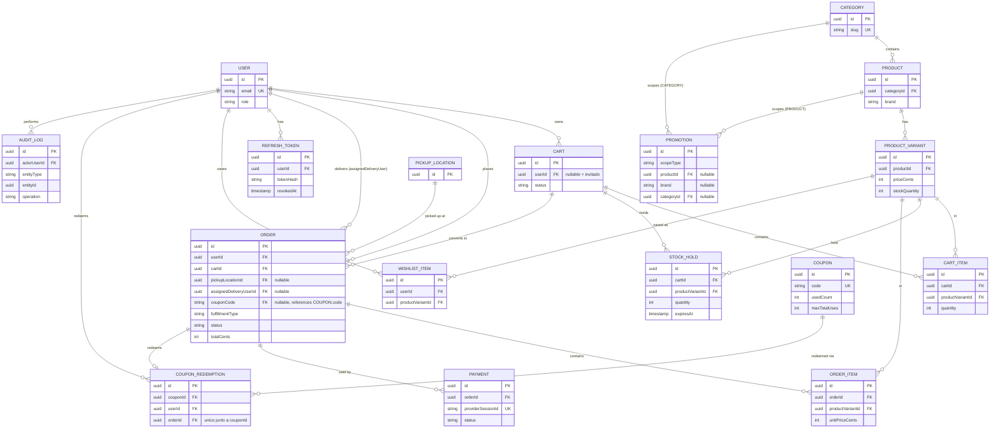

# Phase 1 Data Model: Core Store & RBAC

Fuente: `spec.md` → Key Entities, Functional Requirements, Clarifications.

## Diagrama de relaciones



## Role (enum)

`USER` | `ADMIN` | `INVENTORY_MANAGER` | `DELIVERY`

## User

| Campo | Tipo | Reglas |
|---|---|---|
| id | UUID (PK) | |
| email | string | único, requerido, formato email |
| passwordHash | string \| null | null si la cuenta solo usa OAuth Google |
| name | string | requerido |
| role | Role | default `USER` (FR-013); no auto-asignable por el propio usuario |
| createdAt / updatedAt | timestamp | |

**Relaciones**: 1—N `Cart` (histórico, normalmente 1 activo), 1—N `Order`, 1—N `WishlistItem`,
1—N `Order` (como `assignedDeliveryUser`, solo si `role = DELIVERY`).

## RefreshToken

| Campo | Tipo | Reglas |
|---|---|---|
| id | UUID (PK) | |
| userId | UUID (FK → User) | |
| tokenHash | string | hash del refresh token opaco (research.md §2); el valor en claro nunca se persiste |
| expiresAt | timestamp | `createdAt` + 7 días |
| revokedAt | timestamp \| null | seteado al rotar (uso normal) o al detectar reuso (todas las del `userId`) |
| createdAt | timestamp | |

**Uso**: un usuario puede tener varios `RefreshToken` activos (multi-dispositivo/sesión). La
rotación en cada `/auth/refresh` marca `revokedAt` en el usado y crea uno nuevo; presentar un
token con `revokedAt` no nulo dispara la revocación de todos los `RefreshToken` activos de ese
`userId` (research.md §2).

## StockHold

| Campo | Tipo | Reglas |
|---|---|---|
| id | UUID (PK) | |
| cartId | UUID (FK → Cart) | |
| productVariantId | UUID (FK → ProductVariant) | |
| quantity | integer | > 0 |
| expiresAt | timestamp | `createdAt` + 15 min (FR-024) |
| createdAt | timestamp | |

**Uso**: creado dentro de una transacción con `SELECT ... FOR UPDATE` sobre `ProductVariant`
(research.md §3, "Race Condition") — evita la sobreventa por *check-then-act* que tenía el
diseño original basado en Redis. Un hold vencido (`expiresAt <= now()`) deja de contar en la
disponibilidad efectiva sin necesidad de borrarlo activamente; se borra recién al confirmar el
pago (o por limpieza periódica de higiene, no de corrección).

## Category

| Campo | Tipo | Reglas |
|---|---|---|
| id | UUID (PK) | |
| name | string | único |
| slug | string | único, usado en filtros de catálogo (FR-002) |

## Product

| Campo | Tipo | Reglas |
|---|---|---|
| id | UUID (PK) | |
| name | string | requerido, indexado para búsqueda (FR-003) |
| description | text | |
| brand | string \| null | texto libre; usado como alcance de `Promotion` (FR-032) — sin entidad `Brand` propia (Assumptions) |
| categoryId | UUID (FK → Category) | requerido |
| createdAt / updatedAt | timestamp | |

**Relaciones**: N—1 `Category`; 1—N `ProductVariant` (mínimo 1, US4-AS1).

## ProductVariant

| Campo | Tipo | Reglas |
|---|---|---|
| id | UUID (PK) | |
| productId | UUID (FK → Product) | requerido |
| attributes | jsonb | ej. `{ color, capacidad }` |
| priceCents | integer | precio en céntimos de PEN (FR-023) — evita floats en dinero |
| stockQuantity | integer | >= 0; disponibilidad efectiva = `stockQuantity - Σ StockHold.quantity con expiresAt > now()` (research.md §3, Postgres — revisado) |

## PickupLocation

| Campo | Tipo | Reglas |
|---|---|---|
| id | UUID (PK) | |
| name / address | string | requerido |
| active | boolean | default true |

## Cart

| Campo | Tipo | Reglas |
|---|---|---|
| id | UUID (PK) | invitado: id generado client-side/cookie; autenticado: 1 carrito activo por `User` |
| userId | UUID \| null (FK → User) | null = carrito de invitado (vive en Redis, no en Postgres) — único uso de Redis que queda en el modelo tras research.md §3 |
| status | enum(`ACTIVE`, `CONVERTED`, `ABANDONED`) | `CONVERTED` al crear `Order` |

**Nota de persistencia**: carritos de invitado se guardan en Redis (TTL de sesión, no 15 min);
al iniciar sesión se fusionan con el carrito de `User` en Postgres (FR-007) y el registro Redis
se descarta.

## CartItem

| Campo | Tipo | Reglas |
|---|---|---|
| id | UUID (PK) | |
| cartId | UUID (FK → Cart) | |
| productVariantId | UUID (FK → ProductVariant) | |
| quantity | integer | > 0; validado contra disponibilidad efectiva al agregar/actualizar (FR-006) y de nuevo al checkout (FR-020) |

## Order

| Campo | Tipo | Reglas |
|---|---|---|
| id | UUID (PK) | |
| userId | UUID (FK → User) | requerido (FR-021 — checkout siempre autenticado) |
| cartId | UUID (FK → Cart) | carrito de origen — el trigger `trg_order_item_settle_inventory` lo usa para ubicar y borrar el `StockHold` correspondiente (research.md §3) |
| fulfillmentType | enum(`DELIVERY`, `PICKUP`) | FR-008 |
| pickupLocationId | UUID \| null (FK → PickupLocation) | requerido si `fulfillmentType = PICKUP` |
| deliveryFeeCents | integer | tarifa fija (Assumptions); 0 si `PICKUP` |
| deliveryFormattedAddress | string \| null | requerido si `fulfillmentType = DELIVERY` (FR-025/026); seleccionada vía mapa (research.md §11) |
| deliveryLatitude | decimal \| null | requerido si `fulfillmentType = DELIVERY` |
| deliveryLongitude | decimal \| null | requerido si `fulfillmentType = DELIVERY` |
| assignedDeliveryUserId | UUID \| null (FK → User, role `DELIVERY`) | solo si `fulfillmentType = DELIVERY`; asignado únicamente por `ADMIN` (FR-022) |
| couponCode | string \| null | código del `Coupon` aplicado, si hubo (FR-028) |
| discountCents | integer | default 0; descuento aplicado por el cupón, ya congelado al confirmar el pago |
| status | enum (ver máquina de estados abajo) | |
| totalCents | integer | suma de `OrderItem` + `deliveryFeeCents` - `discountCents` |
| currency | literal `"PEN"` | FR-023 |
| createdAt / updatedAt | timestamp | |

**Máquina de estados** (detalle mínimo del spec, Assumptions):

```
PENDING_PAYMENT → PAID → PREPARING → (DELIVERY: OUT_FOR_DELIVERY → DELIVERED)
                                     (PICKUP: READY_FOR_PICKUP → PICKED_UP)
PENDING_PAYMENT → CANCELLED   (pago falla/expira el hold de stock)
```

- `DELIVERY` (rol) solo puede mover `OUT_FOR_DELIVERY → DELIVERED` en pedidos que tiene
  asignados (FR-018).
- `ADMIN` puede mover cualquier transición en cualquier pedido (FR-017).

## OrderItem

| Campo | Tipo | Reglas |
|---|---|---|
| id | UUID (PK) | |
| orderId | UUID (FK → Order) | |
| productVariantId | UUID (FK → ProductVariant) | |
| quantity | integer | > 0 |
| unitPriceCents | integer | precio **congelado** al momento de la compra (FR-011), no referencia el precio actual de `ProductVariant` |

## Payment

| Campo | Tipo | Reglas |
|---|---|---|
| id | UUID (PK) | |
| orderId | UUID (FK → Order) | |
| provider | literal `"stripe"` | |
| providerSessionId | string | id de la Checkout Session de Stripe; **UNIQUE** — garantiza idempotencia del webhook (research.md §4, "Idempotencia") |
| status | enum(`PENDING`, `SUCCEEDED`, `FAILED`) | actualizado por el webhook (research.md §4) |
| amountCents | integer | |

## WishlistItem

| Campo | Tipo | Reglas |
|---|---|---|
| id | UUID (PK) | |
| userId | UUID (FK → User) | |
| productVariantId | UUID (FK → ProductVariant) | |
| createdAt | timestamp | par `(userId, productVariantId)` único |

## Coupon

| Campo | Tipo | Reglas |
|---|---|---|
| id | UUID (PK) | |
| code | string | único, case-insensitive |
| discountType | enum(`PERCENTAGE`, `FIXED_AMOUNT`) | FR-027 |
| discountValue | integer | porcentaje (1-100) o céntimos de PEN según `discountType` |
| minOrderAmountCents | integer \| null | monto mínimo de compra para aplicar (FR-029) |
| maxTotalUses | integer \| null | null = ilimitado |
| maxUsesPerUser | integer \| null | null = ilimitado |
| usedCount | integer | default 0; incrementado atómicamente al confirmar pago (research.md §11, ACID) |
| validFrom / validUntil | timestamp | FR-027 |
| active | boolean | default true; `ADMIN` puede desactivar sin borrar |

## CouponRedemption

| Campo | Tipo | Reglas |
|---|---|---|
| id | UUID (PK) | |
| couponId | UUID (FK → Coupon) | |
| userId | UUID (FK → User) | usado para el límite por usuario (FR-027) |
| orderId | UUID (FK → Order) | **UNIQUE junto a `couponId`** — idempotencia, mismo patrón que `Payment.providerSessionId` (research.md §4) |
| createdAt | timestamp | |

## Promotion

| Campo | Tipo | Reglas |
|---|---|---|
| id | UUID (PK) | |
| name | string | etiqueta interna para `ADMIN` (ej. "Black Friday Laptops") |
| discountType | enum(`PERCENTAGE`, `FIXED_AMOUNT`) | FR-032 |
| discountValue | integer | porcentaje (1-100) o céntimos de PEN |
| scopeType | enum(`PRODUCT`, `BRAND`, `CATEGORY`) | FR-032/034 — "tipo de producto" se trata como `CATEGORY` (Assumptions del spec) |
| productId | UUID \| null (FK → Product) | requerido si `scopeType = PRODUCT` |
| brand | string \| null | requerido si `scopeType = BRAND`; comparado contra `Product.brand` |
| categoryId | UUID \| null (FK → Category) | requerido si `scopeType = CATEGORY` |
| validFrom / validUntil | timestamp | FR-032 |
| active | boolean | default true |

**Cálculo de precio efectivo** (catálogo, carrito, checkout): para cada `ProductVariant`, se
buscan las `Promotion` activas (`active = true`, `validFrom <= now <= validUntil`) cuyo
`scopeType`/valor coincida con el producto — por `productId` directo, por `brand` del
producto, o por `categoryId` del producto. Si hay más de una coincidencia, gana la más
específica (`PRODUCT > BRAND > CATEGORY`, FR-034); en empate de especificidad, la de mayor
descuento resultante. El precio final se calcula en el momento de la lectura (no se persiste
en `ProductVariant`) — al confirmar el pago, el precio con descuento ya calculado se congela
en `OrderItem.unitPriceCents` (FR-035), igual que ya ocurre con el precio base (FR-011).

## Vistas (Views)

Vistas normales (no materializadas) — se calculan en cada lectura, sin invalidación ni
staleness, consistente con la decisión de research.md §§3 y 13 de no persistir precio/stock
efectivos. Se exponen a TypeORM como `@ViewEntity` de solo lectura, para no reimplementar la
misma lógica en cada service.

**`v_product_effective_stock`** — respalda `stockQuantity` efectivo (research.md §3):

```sql
CREATE VIEW v_product_effective_stock AS
SELECT
  pv.id AS product_variant_id,
  pv.stock_quantity,
  COALESCE(held.held_quantity, 0) AS held_quantity,
  pv.stock_quantity - COALESCE(held.held_quantity, 0) AS effective_stock
FROM product_variant pv
LEFT JOIN LATERAL (
  SELECT SUM(sh.quantity) AS held_quantity
  FROM stock_hold sh
  WHERE sh.product_variant_id = pv.id AND sh.expires_at > now()
) held ON true;
```

**`v_product_effective_price`** — respalda el precio con `Promotion` aplicada, precedencia
`PRODUCT > BRAND > CATEGORY` con desempate por mayor descuento (research.md §13, FR-034):

```sql
CREATE VIEW v_product_effective_price AS
SELECT
  pv.id AS product_variant_id,
  pv.product_id,
  pv.price_cents AS base_price_cents,
  COALESCE(best.discount_price_cents, pv.price_cents) AS effective_price_cents,
  best.promotion_id
FROM product_variant pv
JOIN product p ON p.id = pv.product_id
LEFT JOIN LATERAL (
  SELECT
    promo.id AS promotion_id,
    CASE promo.discount_type
      WHEN 'PERCENTAGE'    THEN pv.price_cents - (pv.price_cents * promo.discount_value / 100)
      WHEN 'FIXED_AMOUNT'  THEN GREATEST(pv.price_cents - promo.discount_value, 0)
    END AS discount_price_cents,
    CASE promo.scope_type
      WHEN 'PRODUCT'  THEN 1
      WHEN 'BRAND'    THEN 2
      WHEN 'CATEGORY' THEN 3
    END AS specificity
  FROM promotion promo
  WHERE promo.active
    AND now() BETWEEN promo.valid_from AND promo.valid_until
    AND (
      (promo.scope_type = 'PRODUCT'  AND promo.product_id  = p.id) OR
      (promo.scope_type = 'BRAND'    AND promo.brand       = p.brand) OR
      (promo.scope_type = 'CATEGORY' AND promo.category_id = p.category_id)
    )
  ORDER BY specificity ASC, discount_price_cents ASC  -- más específica gana; empate → mayor descuento
  LIMIT 1
) best ON true;
```

**`v_order_summary`** — conveniencia para el panel `ADMIN` (listado de pedidos sin que cada
endpoint reimplemente el join+agregación):

```sql
CREATE VIEW v_order_summary AS
SELECT
  o.id AS order_id,
  o.status,
  o.fulfillment_type,
  o.total_cents,
  o.currency,
  o.created_at,
  u.email AS user_email,
  COUNT(oi.id) AS item_count,
  SUM(oi.quantity) AS total_units
FROM "order" o
JOIN "user" u ON u.id = o.user_id
JOIN order_item oi ON oi.order_id = o.id
GROUP BY o.id, u.email;
```

## Triggers

> **Revisión**: la versión anterior de esta sección dejaba el descuento de stock y la
> redención de cupón como lógica de service (NestJS haciendo `SELECT ... FOR UPDATE` +
> `UPDATE`/`INSERT` a mano). Se mueve a triggers vía un patrón de **`UPDATE` condicional
> atómico** (`WHERE saldo >= cantidad`, sin necesitar `FOR UPDATE` explícito — el propio
> `UPDATE` toma el row lock) — es más simple que lo que reemplaza, no solo "menos código en el
> backend": el invariante queda garantizado sin importar qué service/ruta escriba la fila, y
> el service de NestJS que confirma el pago se reduce a 3 `INSERT` (`Payment`, `Order`,
> `OrderItem`) dentro de una transacción; los triggers hacen el resto.

**`trg_order_item_settle_inventory`** — al insertar un `OrderItem`, descuenta el stock real de
forma atómica y borra el `StockHold` que ese pedido consume (usa `Order.cartId` para
ubicarlo, research.md §3). Si el stock efectivo ya no alcanza (caso extremo: se saltó la
reserva), aborta con excepción y hace `ROLLBACK` de toda la transacción del pedido:

```sql
CREATE OR REPLACE FUNCTION settle_inventory_on_order_item()
RETURNS TRIGGER AS $$
DECLARE
  v_cart_id uuid;
  v_remaining int;
BEGIN
  SELECT cart_id INTO v_cart_id FROM "order" WHERE id = NEW.order_id;

  UPDATE product_variant
  SET stock_quantity = stock_quantity - NEW.quantity
  WHERE id = NEW.product_variant_id
    AND stock_quantity >= NEW.quantity
  RETURNING stock_quantity INTO v_remaining;

  IF NOT FOUND THEN
    RAISE EXCEPTION 'stock insuficiente para variante % (pedido %)', NEW.product_variant_id, NEW.order_id
      USING ERRCODE = 'TS001'; -- código custom: permite al backend traducirlo a un mensaje
                                -- entendible sin matchear el texto (research.md §15)
  END IF;

  DELETE FROM stock_hold
  WHERE cart_id = v_cart_id AND product_variant_id = NEW.product_variant_id;

  RETURN NEW;
END;
$$ LANGUAGE plpgsql;

CREATE TRIGGER trg_order_item_settle_inventory
  AFTER INSERT ON order_item
  FOR EACH ROW EXECUTE FUNCTION settle_inventory_on_order_item();
```

**`trg_order_redeem_coupon`** — al insertar un `Order` con `coupon_code` no nulo, redime el
cupón de forma atómica (incrementa `usedCount` solo si aún hay cupo, research.md §12) e
inserta el `CouponRedemption`. Si el cupón se agotó justo en ese instante, **no** aborta la
transacción (el pago ya está autorizado en Stripe) — solo no se registra la redención; la
decisión de si igual honrar el descuento en `Order.discountCents` la toma el service antes del
`INSERT` (revalidación al confirmar, FR-030), este trigger solo garantiza que el contador
nunca se pase del límite:

```sql
CREATE OR REPLACE FUNCTION redeem_coupon_on_order()
RETURNS TRIGGER AS $$
DECLARE
  v_coupon_id uuid;
BEGIN
  IF NEW.coupon_code IS NULL THEN
    RETURN NEW;
  END IF;

  UPDATE coupon AS c
  SET used_count = used_count + 1
  WHERE c.code = NEW.coupon_code
    AND c.active
    AND now() BETWEEN c.valid_from AND c.valid_until
    AND (c.max_total_uses IS NULL OR c.used_count < c.max_total_uses)
    AND (
      c.max_uses_per_user IS NULL OR
      (SELECT COUNT(*) FROM coupon_redemption cr
       WHERE cr.coupon_id = c.id AND cr.user_id = NEW.user_id) < c.max_uses_per_user
    )
  RETURNING c.id INTO v_coupon_id;

  IF v_coupon_id IS NOT NULL THEN
    INSERT INTO coupon_redemption (id, coupon_id, user_id, order_id, created_at)
    VALUES (gen_random_uuid(), v_coupon_id, NEW.user_id, NEW.id, now());
  END IF;

  RETURN NEW;
END;
$$ LANGUAGE plpgsql;

CREATE TRIGGER trg_order_redeem_coupon
  AFTER INSERT ON "order"
  FOR EACH ROW EXECUTE FUNCTION redeem_coupon_on_order();
```

**`trg_cart_convert_on_order`** — gap detectado en esta revisión: nada marcaba
`Cart.status = 'CONVERTED'` (data-model.md §Cart) cuando el carrito efectivamente se
convertía en pedido; quedaba como responsabilidad implícita del service sin dueño claro. Se
resuelve con el mismo evento que ya disparan los otros dos triggers de `Order`:

```sql
CREATE OR REPLACE FUNCTION convert_cart_on_order()
RETURNS TRIGGER AS $$
BEGIN
  UPDATE cart SET status = 'CONVERTED' WHERE id = NEW.cart_id;
  RETURN NEW;
END;
$$ LANGUAGE plpgsql;

CREATE TRIGGER trg_cart_convert_on_order
  AFTER INSERT ON "order"
  FOR EACH ROW EXECUTE FUNCTION convert_cart_on_order();
```

(Nota: dos triggers `AFTER INSERT` distintos sobre `"order"` — `trg_order_redeem_coupon` y
`trg_cart_convert_on_order` — coexisten sin problema; Postgres ejecuta ambos en la misma
transacción, en orden alfabético por nombre de trigger.)

**`trg_set_updated_at`** — evita que cada service tenga que setear `updatedAt` a mano en cada
`UPDATE`; una sola función reutilizada por trigger en cada tabla que tiene esa columna:

```sql
CREATE OR REPLACE FUNCTION set_updated_at()
RETURNS TRIGGER AS $$
BEGIN
  NEW.updated_at = now();
  RETURN NEW;
END;
$$ LANGUAGE plpgsql;

CREATE TRIGGER trg_user_updated_at    BEFORE UPDATE ON "user"          FOR EACH ROW EXECUTE FUNCTION set_updated_at();
CREATE TRIGGER trg_product_updated_at BEFORE UPDATE ON product         FOR EACH ROW EXECUTE FUNCTION set_updated_at();
CREATE TRIGGER trg_order_updated_at   BEFORE UPDATE ON "order"         FOR EACH ROW EXECUTE FUNCTION set_updated_at();
```

**Sigue sin ser trigger** (misma razón que antes, ahora acotada a un solo caso): la
rotación/revocación de refresh tokens (research.md §2) — su "detectar reuso → revocar TODAS
las sesiones del usuario" es un evento de seguridad que además debería loguearse/alertar
(Sentry, `references/observability.md` de `nestjs-pro`), algo que un trigger no puede hacer
limpiamente. Se queda como service de NestJS.

**Constraints declarativos que respaldan a los triggers** (defensa adicional, sin
procedimiento):

```sql
-- Consistencia de fulfillment: pickup XOR dirección de delivery, nunca ambos ni ninguno.
ALTER TABLE "order" ADD CONSTRAINT chk_fulfillment_consistency CHECK (
  (fulfillment_type = 'PICKUP'   AND pickup_location_id IS NOT NULL AND delivery_formatted_address IS NULL) OR
  (fulfillment_type = 'DELIVERY' AND delivery_formatted_address IS NOT NULL AND pickup_location_id IS NULL)
);

-- Nunca stock negativo (ya lo garantiza trg_order_item_settle_inventory; este CHECK es el
-- último recurso si algún día algo escribe stock_quantity fuera de ese trigger).
ALTER TABLE product_variant ADD CONSTRAINT chk_stock_non_negative CHECK (stock_quantity >= 0);

-- Nunca más redenciones que el límite (mismo respaldo para trg_order_redeem_coupon).
ALTER TABLE coupon ADD CONSTRAINT chk_coupon_usage CHECK (
  max_total_uses IS NULL OR used_count <= max_total_uses
);
```

**Qué queda en el service de NestJS ahora** (confirmación de pago, research.md §§4, 6): dentro
de una transacción, `INSERT Payment` (constraint único = idempotencia) → `INSERT Order` (con
`coupon_code` si aplica → dispara `trg_order_redeem_coupon`) → `INSERT OrderItem` por cada
ítem (dispara `trg_order_item_settle_inventory` por cada uno). Si cualquier trigger lanza
excepción (stock insuficiente), todo el `ROLLBACK` deshace también los `INSERT` anteriores de
esa misma transacción — la atomicidad de research.md §6 se mantiene igual, solo cambió qué capa
ejecuta cada paso.

## Índices

> Gap detectado en esta revisión: se habían diseñado triggers y views pero nunca los índices
> que los sostienen — dos de las tres views (`v_product_effective_stock`,
> `v_product_effective_price`) corren en el path de lectura más caliente de la app (catálogo
> público, US1, sin auth, primer contacto de cualquier visitante) y sin índice hacen table
> scan en `stock_hold`/`promotion` en cada request. Uno por FK (regla general del checklist) +
> los que respaldan un `WHERE`/`JOIN` específico ya identificado en research.md/las views:

```sql
-- RefreshToken: lookup por hash en CADA /auth/refresh (research.md §2) — el hot path de auth.
CREATE UNIQUE INDEX idx_refresh_token_hash ON refresh_token (token_hash);
CREATE INDEX idx_refresh_token_user ON refresh_token (user_id);

-- Product: filtro por categoría (FR-002) y por marca (join de v_product_effective_price).
CREATE INDEX idx_product_category ON product (category_id);
CREATE INDEX idx_product_brand ON product (brand) WHERE brand IS NOT NULL;
-- Búsqueda de texto (FR-003) — un índice B-Tree normal no sirve para ILIKE '%term%'.
CREATE INDEX idx_product_name_trgm ON product USING gin (name gin_trgm_ops);
-- (requiere `CREATE EXTENSION IF NOT EXISTS pg_trgm;`, una sola vez por base)

-- ProductVariant: join constante Product → ProductVariant en cada respuesta de catálogo.
CREATE INDEX idx_product_variant_product ON product_variant (product_id);

-- StockHold: dos patrones de acceso distintos, dos índices distintos.
-- 1) v_product_effective_stock: SUM agrupado por variante, solo holds no vencidos.
CREATE INDEX idx_stock_hold_variant_active ON stock_hold (product_variant_id) WHERE expires_at > now();
-- 2) trg_order_item_settle_inventory: DELETE ... WHERE cart_id = ? AND product_variant_id = ?
CREATE INDEX idx_stock_hold_cart_variant ON stock_hold (cart_id, product_variant_id);

-- Cart: encontrar el carrito activo de un usuario; a lo sumo uno ACTIVE por usuario (invariante).
CREATE UNIQUE INDEX idx_cart_user_active ON cart (user_id) WHERE status = 'ACTIVE';

-- CartItem: listar ítems de un carrito (lectura más frecuente del carrito).
CREATE INDEX idx_cart_item_cart ON cart_item (cart_id);
CREATE INDEX idx_cart_item_variant ON cart_item (product_variant_id);

-- Order: historial propio (FR-012), panel ADMIN por estado, y bandeja de DELIVERY
-- ("mis pedidos asignados que no están entregados" — compuesto, columna más selectiva primero).
CREATE INDEX idx_order_user ON "order" (user_id, created_at DESC);
CREATE INDEX idx_order_delivery_status ON "order" (assigned_delivery_user_id, status)
  WHERE assigned_delivery_user_id IS NOT NULL;
CREATE INDEX idx_order_pickup_location ON "order" (pickup_location_id) WHERE pickup_location_id IS NOT NULL;

-- OrderItem: listar ítems de un pedido (join en cada GET /orders/:id).
CREATE INDEX idx_order_item_order ON order_item (order_id);

-- Payment: join Order → Payment (historial, admin); providerSessionId ya es UNIQUE (§data-model).
CREATE INDEX idx_payment_order ON payment (order_id);

-- WishlistItem: "¿está en mi wishlist?" + evita duplicados (ya declarado como único en la tabla).
CREATE UNIQUE INDEX idx_wishlist_user_variant ON wishlist_item (user_id, product_variant_id);

-- CouponRedemption: el propio trigger de redención hace este COUNT en cada Order con cupón
-- (research.md §12) — sin este índice, cada checkout con cupón hace table scan.
CREATE INDEX idx_coupon_redemption_coupon_user ON coupon_redemption (coupon_id, user_id);

-- AuditLog: consulta típica del panel ADMIN es "historial de esta entidad" o "acciones de este actor".
CREATE INDEX idx_audit_log_entity ON audit_log (entity_type, entity_id, created_at DESC);
CREATE INDEX idx_audit_log_actor ON audit_log (actor_user_id, created_at DESC);

-- Promotion: v_product_effective_price hace 3 patrones de match distintos (research.md §13) —
-- un índice parcial por scopeType, no uno genérico, porque cada query solo toca su propio scope.
CREATE INDEX idx_promotion_product ON promotion (product_id) WHERE scope_type = 'PRODUCT' AND active;
CREATE INDEX idx_promotion_brand ON promotion (brand) WHERE scope_type = 'BRAND' AND active;
CREATE INDEX idx_promotion_category ON promotion (category_id) WHERE scope_type = 'CATEGORY' AND active;
```

**Deliberadamente NO indexado**: `Order.status` sola (sin combinar con `assignedDeliveryUserId`
o `userId`) — el panel `ADMIN` que lista "todos los pedidos" no filtra por estado con
suficiente selectividad a escala de portafolio como para justificar un índice extra
(Principio V); si eso cambia, se agrega después con una migración, no antes de tener el
patrón de acceso real.

## Estrategia ON DELETE (foreign keys)

No especificado hasta esta revisión — el checklist de la skill lo marca como obligatorio por
FK. Regla general: si la fila es un **registro financiero/histórico** (pedido, pago, redención
de cupón), `RESTRICT` — nunca se borra en cascada un rastro de dinero real, aunque hoy ninguna
funcionalidad del spec borre esas filas. Si es **dato derivado/desechable** del dueño
(carrito, wishlist, sesión), `CASCADE`. Si es una **referencia opcional** que puede perder su
destino sin invalidar la fila que la tiene, `SET NULL`.

| FK | Estrategia | Por qué |
|---|---|---|
| `RefreshToken.userId → User` | CASCADE | Datos de sesión, desechables con el usuario |
| `Cart.userId → User` | CASCADE | Carrito es dato derivado del usuario |
| `StockHold.cartId → Cart` | CASCADE | El hold no tiene sentido sin su carrito |
| `StockHold.productVariantId → ProductVariant` | CASCADE | Idem — evita holds huérfanos |
| `CartItem.cartId → Cart` | CASCADE | Ítem no existe sin su carrito |
| `CartItem.productVariantId → ProductVariant` | RESTRICT | No borrar una variante referenciada en un carrito activo — desactivar (`stockQuantity = 0` / futuro soft-delete), no borrar |
| `Order.userId → User` | **RESTRICT** | Registro financiero — nunca se borra en cascada (Principio IV) |
| `Order.cartId → Cart` | RESTRICT | Idem — el pedido debe sobrevivir a cualquier cosa que le pase al carrito |
| `Order.pickupLocationId → PickupLocation` | RESTRICT | Historial de pedidos no debe perder su sucursal; desactivar con `active = false`, no borrar |
| `Order.assignedDeliveryUserId → User` | SET NULL | Relación opcional — si se borra la cuenta del repartidor, el pedido queda sin asignar, no se borra |
| `OrderItem.orderId → Order` | CASCADE | Ítem no existe sin su pedido |
| `OrderItem.productVariantId → ProductVariant` | RESTRICT | El precio ya está congelado (FR-011), pero la referencia debe seguir resolviendo para reportes |
| `Payment.orderId → Order` | CASCADE | Pago es hijo directo del pedido |
| `WishlistItem.userId / productVariantId` | CASCADE | Dato desechable, sin valor histórico/legal |
| `CouponRedemption.couponId → Coupon` | RESTRICT | Registro de auditoría de descuentos aplicados |
| `CouponRedemption.userId → User` | RESTRICT | Idem |
| `CouponRedemption.orderId → Order` | CASCADE | Si el pedido (financiero) se borra, su redención asociada se borra con él |
| `Promotion.productId / categoryId → Product / Category` | CASCADE | Promoción sin su producto/categoría no tiene sentido — se borra con ellos |
| `AuditLog.actorUserId → User` | RESTRICT | El rastro de auditoría no debe desaparecer si se borra la cuenta del actor — es justo el caso que debe sobrevivir |

## AuditLog

| Campo | Tipo | Reglas |
|---|---|---|
| id | UUID (PK) | |
| actorUserId | UUID (FK → User) | requerido — toda acción auditada la hace un `ADMIN`/`INVENTORY_MANAGER`/`DELIVERY` autenticado, nunca anónima |
| entityType | string | `Order`, `Product`, `ProductVariant`, `Category`, `Coupon`, `Promotion`, `PickupLocation` |
| entityId | UUID | |
| operation | enum(`CREATE`, `UPDATE`, `DELETE`) | cambios de estado/asignación de `Order` son `UPDATE` |
| metadata | jsonb \| null | solo los campos que cambiaron, formato `{ "campo": { "from": ..., "to": ... } }` — ej. `{ "status": { "from": "PAID", "to": "PREPARING" } }` |
| createdAt | timestamp | |

**Alcance deliberadamente acotado** (evitar sobre-ingeniería): NO es un audit log genérico de
"toda mutación de toda tabla" — solo cubre las acciones con privilegio elevado que importan
para trazabilidad (transición/asignación de `Order`, y CRUD de catálogo/cupones/promociones/
sucursales por `ADMIN`/`INVENTORY_MANAGER`). Acciones de `USER` sobre sus propios datos
(carrito, wishlist) NO se auditan — no son privilegiadas, ya tienen su propio rastro en las
tablas de negocio (`Order`, `OrderItem`).

**Mecanismo: interceptor de NestJS, no trigger de Postgres.** A diferencia del stock/cupón
(donde el invariante debía sobrevivir sin importar qué código lo tocara, research.md §§3, 12),
acá solo existe **un** camino de escritura posible — la API NestJS (Principio I, API-First: el
frontend nunca toca Postgres directo) — así que un interceptor aplicado a los endpoints
`ADMIN`/`INVENTORY_MANAGER` relevantes (`contracts/api.md`) captura el 100% de los casos sin
necesitar duplicar la lógica a nivel de base de datos. Un trigger habría requerido pasar el
`actorUserId` a Postgres vía variable de sesión (`SET LOCAL app.actor_id`) — plomería extra
para resolver un problema que aquí no existe, porque no hay un segundo camino de escritura que
un trigger necesite cubrir.

## Fuera de alcance de este modelo (Assumptions del spec)

- Stock por sucursal (multi-almacén): se asume `stockQuantity` global por variante, no por
  `PickupLocation`.
- Libreta de direcciones guardadas por usuario — cada `Order` de delivery captura su propia
  dirección, no hay una entidad `Address` reutilizable.
- Cupones por producto/categoría o cupones apilables — un `Order` admite como mucho un
  `couponCode` aplicado sobre el total.
- `Brand` como entidad propia (páginas de marca, CRUD dedicado) — es solo un campo de texto en
  `Product`.
- Auditoría de qué `Promotion` específica se aplicó a cada `OrderItem` — solo se congela el
  precio resultante, no una referencia a la promoción (igual tratamiento que el precio base).
- Apilar más de una `Promotion` sobre el mismo producto — se aplica exactamente una (la más
  específica, con desempate por mayor descuento), nunca la suma de varias.
